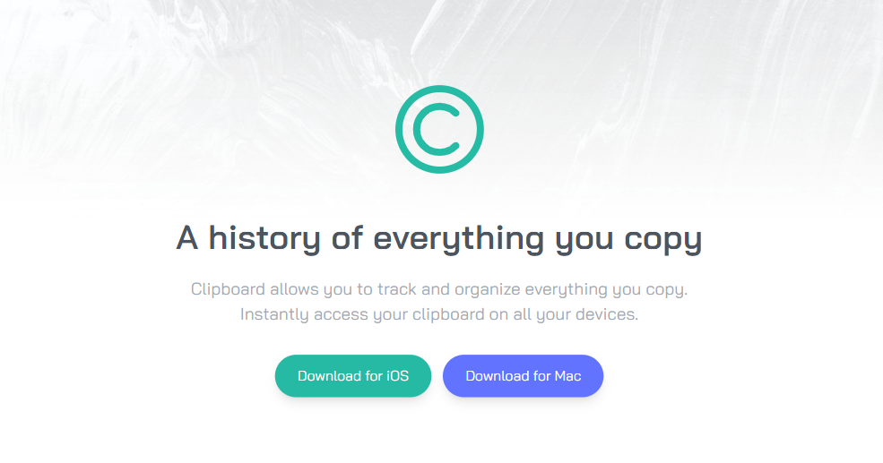

# Clipboard - Copy Tracking and Organization Tool

Clipboard is a versatile tool that enables you to efficiently manage and organize your copied content across all your devices. Whether you're working on a research project, compiling information, or just want to streamline your workflow, Clipboard has got you covered. With its intuitive interface and seamless synchronization, Clipboard empowers you to access and manage your clipboard content anytime, anywhere.

## Features

- **Cross-Device Sync:** Clipboard leverages cloud technology to ensure that your copied items are instantly available on all your devices. Whether you're switching between your computer, tablet, or smartphone, your clipboard history remains consistent and readily accessible.

- **Clipboard History:** Keep track of all the items you've copied. Clipboard retains a history of your copied text, images, links, and other content types, allowing you to quickly retrieve and re-use them.

- **Organizational Tools:** Clipboard understands that organization is key. Categorize your clipboard entries into custom folders or add descriptive tags. This way, you can effortlessly locate the content you need, even if it was copied days or weeks ago.

- **Search Functionality:** Looking for a specific copied snippet? Clipboard's robust search functionality helps you find it within seconds. Enter keywords, tags, or date ranges, and let Clipboard do the rest.

- **Privacy First:** We take your privacy seriously. Clipboard ensures that your sensitive information remains secure. Clipboard data is encrypted both in transit and at rest, giving you peace of mind knowing that your content is only accessible to you.
